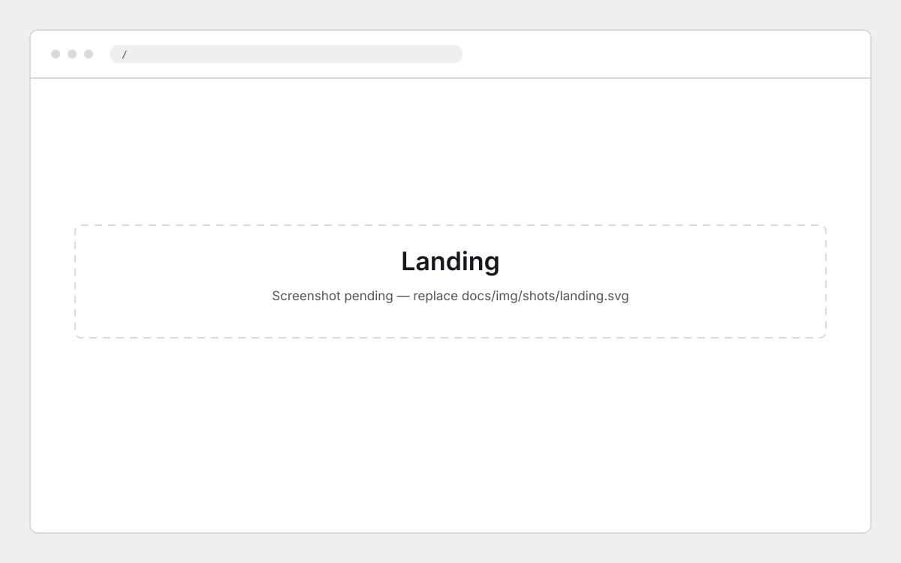
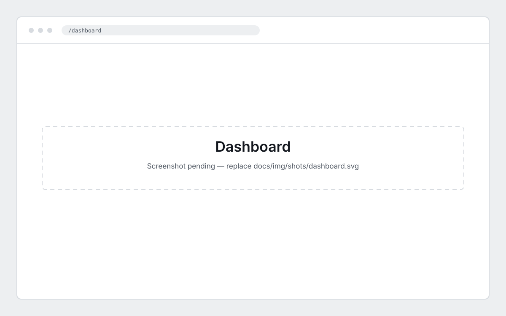
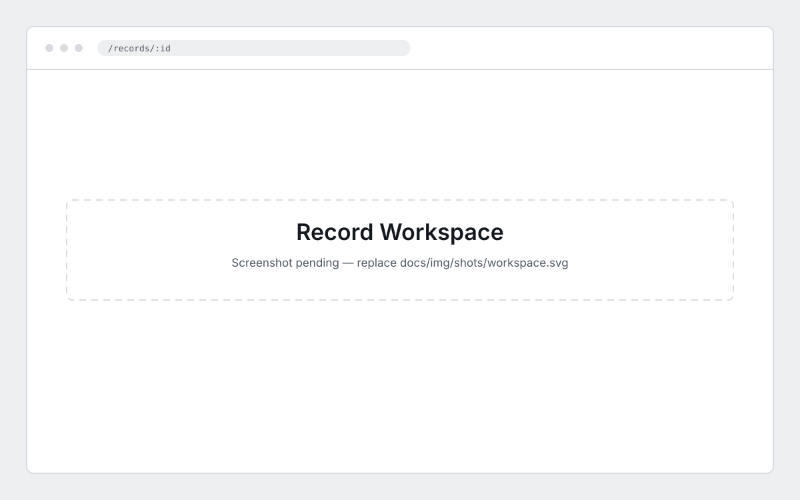
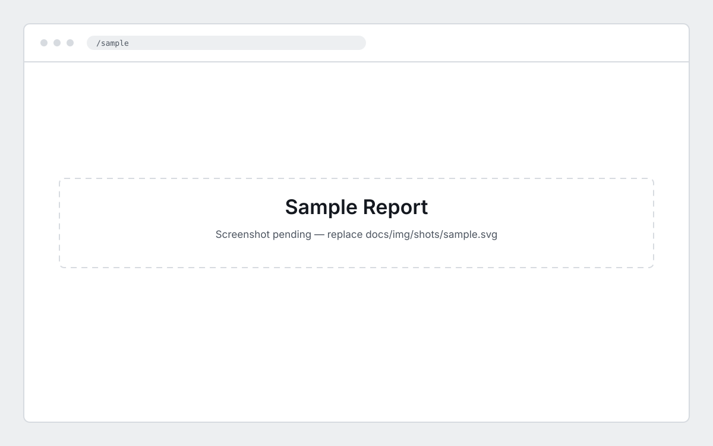
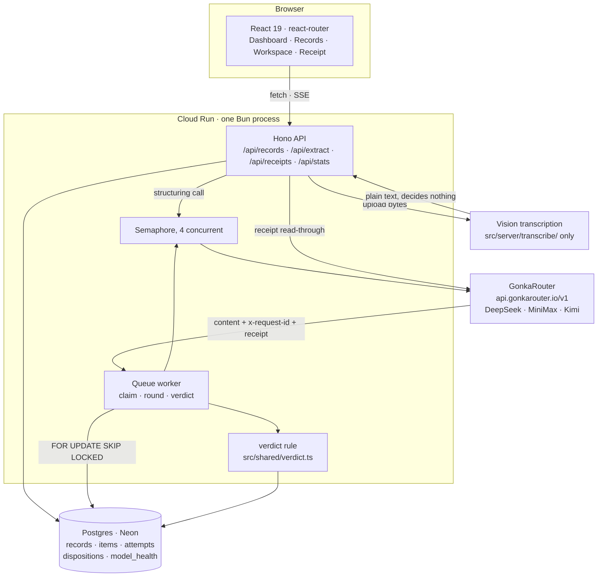

<a id="readme-top"></a>

<!-- PROJECT LOGO -->

<br />
<div align="center">
  <a href="https://github.com/MUBA-M1KU/Cekgu">
    
  </a>

  <h3>Cekgu</h3>

  <p>
    Two blind AI readers check every practice question before learners see it.
    <br />
    <a href="https://cekgu-op7lf5dspq-as.a.run.app"><strong>Live Demo »</strong></a>
    &middot;
    <a href="https://cekgu-op7lf5dspq-as.a.run.app/sample">Sample Report</a>
    &middot;
    <a href="TRD.md">Technical Reference</a>
    &middot;
    <a href="https://github.com/MUBA-M1KU/Cekgu/issues">Issues</a>
    <br />
  </p>

[![Bun][Bun.sh]][Bun-url] [![TypeScript][TypeScript.org]][TypeScript-url] [![React][React.js]][React-url]
[![Hono][Hono.dev]][Hono-url] [![Tailwind][Tailwind.com]][Tailwind-url] [![Postgres][Postgres.org]][Postgres-url]
[![Drizzle][Drizzle.team]][Drizzle-url] [![Cloud Run][CloudRun.dev]][CloudRun-url]

</div>

<!-- TABLE OF CONTENTS -->

## Table of Contents

<details>
  <summary>Expand</summary>
  <ol>
    <li>
      <a href="#about-the-project">About The Project</a>
      <ul>
        <li><a href="#screenshots">Screenshots</a></li>
        <li><a href="#how-it-works">How It Works</a></li>
        <li><a href="#architecture">Architecture</a></li>
        <li><a href="#repository-layout">Repository Layout</a></li>
        <li><a href="#limitations-and-notices">Limitations And Notices</a></li>
      </ul>
    </li>
    <li>
      <a href="#getting-started">Getting Started</a>
      <ul>
        <li><a href="#prerequisites">Prerequisites</a></li>
        <li><a href="#installation">Installation</a></li>
      </ul>
    </li>
    <li><a href="#usage">Usage</a></li>
    <li><a href="#roadmap">Roadmap</a></li>
    <li><a href="#team">Team</a></li>
    <li><a href="#license">License</a></li>
    <li><a href="#acknowledgments">Acknowledgments</a></li>
  </ol>
</details>

<!-- ABOUT THE PROJECT -->

## About The Project

A wrong answer key marks correct learners wrong. Two defensible options reward whoever guessed the setter's intent. Both
defects are usually found after publication, when an educator has to investigate complaints, publish a correction and
remark work. Self-review is anchored to the author's own intended answer, and asking a colleague to re-solve every item
spends the scarcest thing a department has.

Cekgu is the pass before publication. Each multiple-choice question is sent — **without the educator's answer key** — to
two distinct model families through [GonkaRouter](https://api.gonkarouter.io). A fixed rule in
[`src/shared/verdict.ts`](../src/shared/verdict.ts) compares the two readings against each other and against the
supplied key, and returns one of five verdicts with the evidence attached: every attempt, the model that actually served
it, and the gateway request id that proves it. The educator decides what to do, and their decision is appended to the
record rather than overwriting the machine's.

Built for the **GonkaRouter — AI for Society** track of the MUBA Blockchain Hackathon 2026. The track's four
requirements are load-bearing here, not decorations:

| Requirement                             | Where it lives                                                                                                                                                                                                                                           |
| --------------------------------------- | -------------------------------------------------------------------------------------------------------------------------------------------------------------------------------------------------------------------------------------------------------- |
| All reasoning and verification on Gonka | [`src/server/gateway/client.ts`](../src/server/gateway/client.ts) is the only code path that calls a model. [`only-gonkarouter.test.ts`](../src/server/gateway/only-gonkarouter.test.ts) fails the build if a provider host or SDK appears anywhere else |
| At least two models cross-verify        | [`runRound`](../src/server/queue/round.ts) fills two seats from three families and refuses a pair whose receipts name the same served model                                                                                                              |
| Gonka Request IDs surfaced in the UI    | `x-request-id` is read off the response headers, stored on every `attempts` row, listed in the evidence panel, and resolvable at `/receipt/:requestId` against the public gateway endpoint                                                               |
| Explicit consensus logic                | [`verdict()`](../src/shared/verdict.ts) — five outcomes, evaluated in a fixed order, each carrying the sentence that explains it                                                                                                                         |

**Cekgu fails closed.** If two distinct, receipt-verified readings do not survive, the item is **Unverified** and no
verdict is offered. It never certifies a paper, never proves an item correct, and never replaces subject expertise.

<p align="right"><a href="#readme-top">&uarr;</a></p>

### Screenshots

> Placeholders. Replace the SVG in `docs/img/shots/` with a real capture of the same screen, keeping the filename.

|                                                                                     |                                                                                                  |
| ----------------------------------------------------------------------------------- | ------------------------------------------------------------------------------------------------ |
| <br>**Landing** `/`                                | <br>**Dashboard** `/dashboard`                              |
| <br>**New Check** `/new-check`                 | <br>**Records** `/records`                                      |
| <br>**Record Workspace** `/records/:id` | <br>**Evidence Panel** — every attempt, admitted or not |
| <br>**Receipt View** `/receipt/:requestId`    | <br>**Sample Report** `/sample`, readable signed out       |

<p align="right"><a href="#readme-top">&uarr;</a></p>

### How It Works

**1. A paper goes in.** Type the questions on `/new-check`, or upload a PNG, JPEG, WebP or PDF up to 10 MB and let
`POST /api/extract` turn it into a draft. The draft is never submitted for you — an extraction nobody read must not
carry the product's name.

**2. The queue claims one item at a time.** `POST /api/records` returns as soon as the rows exist. A worker loop inside
the server process claims the next queued item with `FOR UPDATE SKIP LOCKED`, so a second instance — or the same one
after a crash — never takes an item somebody is already working.

**3. Two seats, three families, no key.** The solver prompt carries the stem, the lettered options, the subject and the
language. It never carries the supplied key, and it never carries the other reader's output; a reader told the key would
confirm it. Each seat takes a family nobody else holds and nobody has already produced a reading from.

**4. Every reading has to pass admission before it counts.** Five conditions, in order, from
[`admitReading`](../src/server/gateway/reading.ts): no transport or gateway error, a receipt whose `model` equals the
model that was requested, a body that parses as the requested JSON, a serving model named by that receipt, and an answer
whose letters are all real options on the item. A reading is labelled with the model **the receipt names**, never with
the one we asked for — otherwise two calls to one model could pose as two readers and cross-verification becomes
fiction.

**5. The rule decides, and says why.** Order matters and the order is a decision: disagreement before ambiguity, so two
readers who both hedge but commit differently are a split; ambiguity before the key, so an item both answered
"correctly" while each saw two defensible options is still flagged.

| Verdict                | The rule that produced it                                                          |
| ---------------------- | ---------------------------------------------------------------------------------- |
| **Split Opinion**      | The two verified readings commit to different answers                              |
| **Possible Ambiguity** | Each verified reading names more than one defensible option                        |
| **Possible Key Error** | Both verified readings agree on an option that is not the supplied key             |
| **Clear**              | Both verified readings agree, and they agree with the supplied key                 |
| **Unverified**         | Fewer than two distinct receipt-verified readings survived, so no verdict is given |

**6. The educator closes the loop.** Key Corrected, Wording Revised, Key Confirmed, Flag Dismissed or Retry Requested.
Dispositions are append-only: one never overwrites the machine verdict or an earlier decision, and a retry is a round
boundary, so an earlier reading is never counted twice.

**What the shipped sample actually shows.** [`benchmark-pass.json`](../src/server/fixtures/benchmark-pass.json) is a
recorded pass captured 3 September 2026 over a 12-item synthetic paper: **42 attempts, 24 of them admitted**, served by
`MiniMaxAI/MiniMax-M2.7` and `moonshotai/Kimi-K2.6`. It returns 9 Clear, 2 Possible Key Error, 1 Possible Ambiguity and
0 Unverified. Both deliberately mis-keyed items were caught. One of the two deliberately ambiguous items was not — see
[Limitations And Notices](#limitations-and-notices).

<p align="right"><a href="#readme-top">&uarr;</a></p>

### Architecture

One Bun process serves the API, the React bundle and the queue worker. Postgres is the only state. The gateway is the
only egress that reaches a model, apart from the single transcription boundary drawn below.



**Provenance is collected before anything else.** The client is hand-rolled `fetch` rather than an OpenAI SDK, because
the SDK returns a parsed body and throws away the headers that carry `x-request-id` — the one thing the attempts table
exists to record. Headers are read before the body, and a call that fails still returns a provenance record.

Four measured behaviours the gateway forced, each of which would silently corrupt the evidence if dropped:

- **`X-Gonka-No-Fallback: true` on every request.** Without it the gateway substitutes another model and says so only in
  a header, so a two-model pair quietly becomes one model twice. A response carrying `x-gonka-fallback` is rejected even
  though its body is a perfectly good completion.
- **A UUID nonce is appended to every prompt.** Byte-identical bodies are served from the gateway cache, which would
  make two samples of one item into one inference wearing two request ids.
- **Receipts are polled, not fetched once.** They are written asynchronously and every measured call 404'd on the first
  try, so the wait comes before the first fetch: 250 ms intervals inside a 5 second budget, each request under its own
  abort signal.
- **`<think>` blocks are stripped.** MiniMax emits raw `<think>` inside the content and Kimi leaks an orphaned closing
  tag; comparing an answer against another model's internal monologue is the failure this prevents.

**The round is built for a network that is slow and sometimes down.** Three attempts per family, a call abandoned at 90
s by the client and 120 s by the round, and a deferred hedge that fires at 45 s — raised from 25 s on measurement,
because at 25 s nearly every call was doubling and the doubling itself produced the account-level 429s. A 15-minute
health ring ranks the families and excludes one at three failures with nothing successful behind it; when fewer than two
families remain healthy the unhealthy ones are **demoted rather than removed**, because a round with one candidate
returns Unverified without a single call being attempted.

**The upload boundary is the one documented exception**, and it is one directory wide.
[`src/server/transcribe/`](../src/server/transcribe/) may reach a vision provider to turn pixels and PDF bytes into the
words printed on the page. That step is forbidden by its own prompt from deciding anything: which text is a question,
which strings are its options, which option the key names is decided afterwards by a Gonka model carrying a request id.
Of the three families the gateway serves, only Kimi reports vision and it is the slowest of them, and a single reader
cannot cross-verify anything in any case. `only-gonkarouter.test.ts` asserts that the boundary never imports the verdict
rule, the schema or the queue — and that the reasoning path names no provider host at all. Without `GEMINI_API_KEY`,
`POST /api/extract` answers 503 and every other route is unchanged.

<p align="right"><a href="#readme-top">&uarr;</a></p>

### Repository Layout

```text
.
├── src/
│   ├── client/            React 19 SPA. pages/, components/, layouts/, mascot/, styles.css
│   ├── server/
│   │   ├── gateway/       The only code that calls a model. client.ts, reading.ts, models.ts
│   │   ├── queue/         claim.ts, round.ts, worker.ts, health.ts, semaphore.ts
│   │   ├── extract/       Turns transcribed text into a draft record, on Gonka
│   │   ├── transcribe/    THE one non-Gonka call. Vision to plain text, decides nothing
│   │   ├── records/       Read queries behind the record routes
│   │   ├── routes/        Hono routes: records, extract, receipts, stats, health, sample, auth
│   │   ├── fixtures/      benchmark-pass.json, evaluation-set.json
│   │   └── db/            Drizzle schema and Better Auth tables
│   └── shared/            verdict.ts, types.ts, schemas.ts, api.ts — used by both halves
├── e2e/                   Playwright, run against a deployment: smoke, flow, demo
├── drizzle/               Generated migrations
├── docs/                  PRODUCT.md, PRD.md, TRD.md, DESIGN.md, brief.md, legal/, source/
├── public/                brand/, mascots/, live2d/, hero/
├── scripts/               check-anchors.ts, capture-benchmark-pass.ts
└── .github/workflows/     ci.yml (checks + tagged preview), deploy.yml (Cloud Run + smoke)
```

<p align="right"><a href="#readme-top">&uarr;</a></p>

### Limitations And Notices

**It is a triage pass, not a certification.** Cekgu directs attention. It does not prove any item correct, does not
approve confidential final examinations, does not grade learners and does not replace institutional moderation.

**Two model opinions are not truth.** A Clear verdict means two readers agreed with the key, and nothing more. Question
6 of the shipped sample — "Which layer of the TCP/IP model does HTTP belong to?" — is labelled `ambiguous` in
[`evaluation-set.json`](../src/server/fixtures/evaluation-set.json) with B and C both defensible, and the recorded pass
returned **Clear** on it. That is a characterised miss, not a fixed one.

**A verdict is not reproducible run to run.** The same item can be Clear in one pass and Unverified in the next.
Unverified is load-driven: a long paper sustains account-level rate limiting that a twelve-item paper never reaches, and
the round then cannot assemble two distinct verified readings.

**Preview deployments share the production database.** PR previews serve no traffic and run with `MIGRATE_ON_START` and
`WORKER_ENABLED` set to `false` for that reason.

**The Guest workspace is shared and temporary.** Everything created there is visible to every other guest and is hard
deleted 24 hours after creation. Private records go to Trash for 30 days, and are retired 90 days after last activity.

**Legal notices** live beside this file: [Terms](legal/terms.md), [Privacy](legal/privacy.md) and
[Acceptable use](legal/acceptable-use.md).

<p align="right"><a href="#readme-top">&uarr;</a></p>

<!-- GETTING STARTED -->

## Getting Started

The app runs as one Bun process. In development the Vite dev server sits in front of it and proxies `/api` through, so
two commands are one `bun run dev`.

### Prerequisites

- **Bun 1.4 or newer** — package manager, runtime and test runner. `curl -fsSL https://bun.sh/install | bash`
- **A Postgres database.** The deployment uses Neon in `ap-southeast-1`. Any Postgres with
  `SELECT ... FOR UPDATE SKIP LOCKED` and a pooled connection string works
- **A GonkaRouter API key** from the GonkaRouter dashboard. Nothing that decides anything runs without it
- **Optional: a Gemini API key.** Only `POST /api/extract` uses it. Absent, uploads are switched off and the rest of the
  product is unchanged
- **Optional: a Google OAuth client.** Absent, email and Guest sign-in still work

### Installation

```bash
git clone https://github.com/MUBA-M1KU/Cekgu.git
cd Cekgu
bun install                 # dependencies, and wires the husky hooks
cp .env.example .env        # then fill it in; .env is gitignored and must stay that way
bun run db:migrate          # applies drizzle/ to DATABASE_URL
bun run dev                 # api on :8080, client on :5173
```

Every name in `.env.example` is required unless marked otherwise there:

| Variable                                    | What it is                                                                  |
| ------------------------------------------- | --------------------------------------------------------------------------- |
| `GONKA_API_KEY`                             | Server only. Never reaches the client bundle                                |
| `GONKA_BASE_URL_OPENAI`                     | Defaults to `https://api.gonkarouter.io/v1`. The `/v1` belongs in the value |
| `DATABASE_URL`                              | Pooled Postgres connection string, `sslmode=require`                        |
| `BETTER_AUTH_SECRET` / `BETTER_AUTH_URL`    | 32+ random bytes, and the public origin with no trailing slash              |
| `GUEST_EMAIL` / `GUEST_PASSWORD`            | The one seeded Guest account behind `POST /api/auth/guest`                  |
| `GOOGLE_CLIENT_ID` / `GOOGLE_CLIENT_SECRET` | Optional. Google sign-in                                                    |
| `GEMINI_API_KEY` / `GEMINI_MODEL`           | Optional. Transcription for Upload a Paper, and nothing else                |
| `MASCOT_ENABLED`                            | `true` turns the Live2D reader mascots on                                   |

<p align="right"><a href="#readme-top">&uarr;</a></p>

<!-- USAGE EXAMPLES -->

## Usage

```bash
bun run dev            # api :8080 + vite :5173, watched
bun run build          # vite build into dist/client
bun run start          # production: one process serving api and bundle on :8080
bun test               # the unit suite
bun run e2e            # Playwright, against the DEPLOYMENT by default — see below
bun run e2e:local      # Playwright, against http://localhost:8080
bun run lint           # biome check . && prettier --check on md/yaml
bun run format         # biome format --write . && prettier --write on md/yaml
bun run typecheck      # tsc --noEmit
bun run check:anchors  # every markdown anchor link in the repo, against its heading
bun run db:generate    # drizzle-kit generate, after a schema change
```

> `bun run e2e` targets the deployed URL, not your working tree. It prints its target on every run. Use
> `bun run e2e:local`, or `E2E_BASE_URL=<url> bun run e2e`, to point it somewhere else.

**Walk the product in about a minute.** Open the [live demo](https://cekgu-op7lf5dspq-as.a.run.app), press **Sign In as
Guest** — no account, no email — and you land on the dashboard. Cross to **Records**, open _Introductory computer
science practice set_, and work down it. Questions 3 and 9 come back **Possible Key Error** — both are deliberately
mis-keyed — and question 11 **Possible Ambiguity**. Press **Show Evidence** on any of them: two readers, two served
model names, two Gonka request ids, and every attempt that did not make it into the verdict listed beside the ones that
did. Click a request id to resolve it at `/receipt/:requestId` against the gateway's own public endpoint. Then record a
disposition — Key Corrected on question 3 — and watch the record move to In Review.

**The API**, all under `/api`. Everything needs a session cookie except where noted.

| Route                                         | Does                                                                       |
| --------------------------------------------- | -------------------------------------------------------------------------- |
| `POST /auth/guest`                            | Signs into the shared Guest workspace. Public                              |
| `GET /session`                                | Who the caller is, and whether this is the Guest account. Public           |
| `POST /records`                               | Creates a record and queues its items. Returns before any checking happens |
| `GET /records`                                | The library, filtered by `status`, `subject`, `attention` and `q`          |
| `GET /records/:id`                            | One record with its items, attempts and dispositions                       |
| `GET /records/:id/events`                     | Server-sent events while a record is checking                              |
| `POST /records/:id/duplicate`                 | Copies a record. The sample may be copied by anyone                        |
| `POST /records/:id/items/:itemId/disposition` | Appends the educator's decision                                            |
| `POST /records/:id/items/:itemId/retry`       | Re-queues an Unverified item as a fresh round                              |
| `DELETE /records`                             | Trash for a private account, hard delete for Guest                         |
| `DELETE /account/records`                     | Hard delete of everything this account owns, Trash included                |
| `POST /extract`                               | Upload to draft. 503 when no transcription key is configured               |
| `GET /receipts/:requestId`                    | Read-through to the gateway's public receipt. Public                       |
| `GET /stats`                                  | Account aggregates, including verified readings against total readings     |
| `GET /health`                                 | Per-family success rate and median latency over 15 minutes. Public         |
| `GET /sample` · `POST /sample/reset`          | The shipped sample; reset is Guest only                                    |

<p align="right"><a href="#readme-top">&uarr;</a></p>

<!-- ROADMAP -->

## Roadmap

See the [open issues](https://github.com/MUBA-M1KU/Cekgu/issues) for a full list of proposed features (and known
issues).

<p align="right"><a href="#readme-top">&uarr;</a></p>

<!-- CONTRIBUTING -->

## Team

<a href="https://github.com/MUBA-M1KU/Cekgu/graphs/contributors">
  
</a>

<p align="right"><a href="#readme-top">&uarr;</a></p>

<!-- LICENSE -->

## License

No open-source licence is granted. This is a private hackathon repository, and all rights are reserved by the team
pending a decision after judging. The product's own user-facing terms are in [`docs/legal/`](legal/).

Third-party assets carry their own terms. The Live2D sample characters **Tororo** and **Hijiki** are used under the
Live2D Free Material License Agreement and are Live2D Inc.'s own sample assets, not Cekgu's; the runtime is the Live2D
Cubism SDK, under Live2D's SDK licence.

<p align="right"><a href="#readme-top">&uarr;</a></p>

<!-- ACKNOWLEDGMENTS -->

## Acknowledgments

- [GonkaRouter](https://api.gonkarouter.io) — the decentralised inference gateway every verdict in this product rests on
- [MUBA Blockchain Hackathon 2026](https://muba.my) — the AI for Society track this was built for
- [Live2D](https://www.live2d.com) — Cubism SDK, and the Tororo & Hijiki sample characters
- [Shields.io](https://shields.io) — the badges above
- [contrib.rocks](https://contrib.rocks) — the contributor image

<p align="right"><a href="#readme-top">&uarr;</a></p>

<!-- MARKDOWN LINKS & IMAGES -->

[Bun.sh]: https://img.shields.io/badge/Bun-000000?style=for-the-badge&logo=bun&logoColor=white
[Bun-url]: https://bun.sh
[TypeScript.org]: https://img.shields.io/badge/TypeScript-3178C6?style=for-the-badge&logo=typescript&logoColor=white
[TypeScript-url]: https://www.typescriptlang.org
[React.js]: https://img.shields.io/badge/React-20232A?style=for-the-badge&logo=react&logoColor=61DAFB
[React-url]: https://react.dev
[Hono.dev]: https://img.shields.io/badge/Hono-E36002?style=for-the-badge&logo=hono&logoColor=white
[Hono-url]: https://hono.dev
[Tailwind.com]: https://img.shields.io/badge/Tailwind-0B1120?style=for-the-badge&logo=tailwindcss&logoColor=38BDF8
[Tailwind-url]: https://tailwindcss.com
[Postgres.org]: https://img.shields.io/badge/Postgres-4169E1?style=for-the-badge&logo=postgresql&logoColor=white
[Postgres-url]: https://www.postgresql.org
[Drizzle.team]: https://img.shields.io/badge/Drizzle-C5F74F?style=for-the-badge&logo=drizzle&logoColor=000000
[Drizzle-url]: https://orm.drizzle.team
[CloudRun.dev]: https://img.shields.io/badge/Cloud%20Run-4285F4?style=for-the-badge&logo=googlecloud&logoColor=white
[CloudRun-url]: https://cloud.google.com/run
