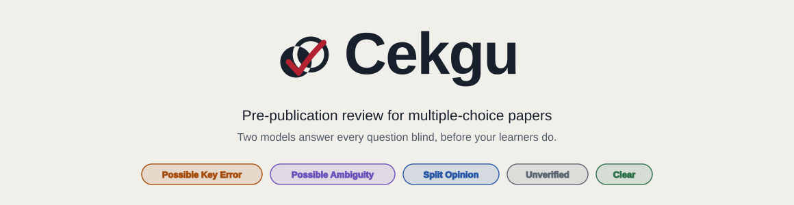
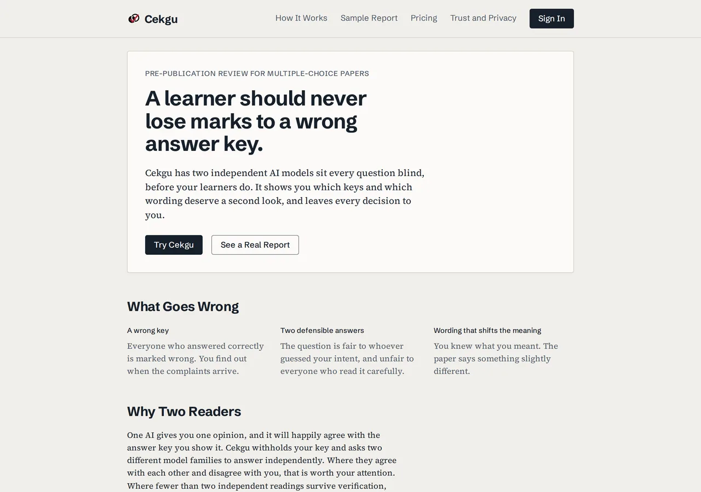
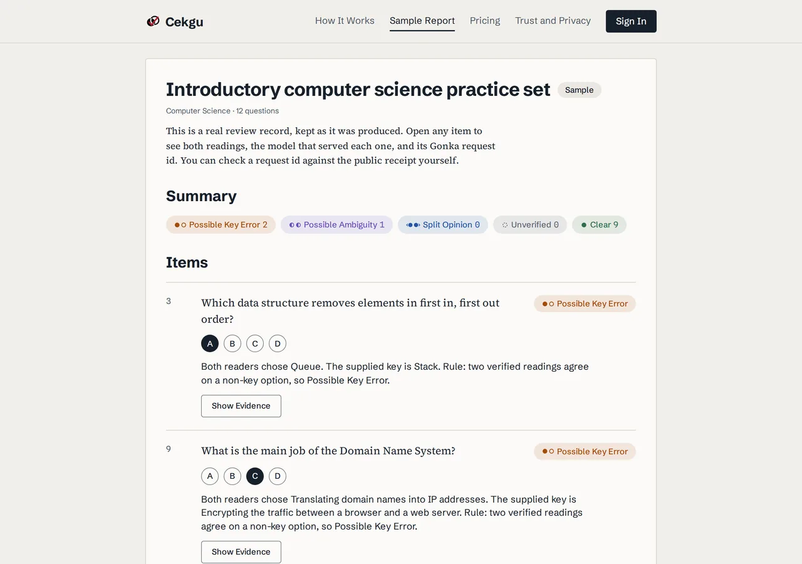
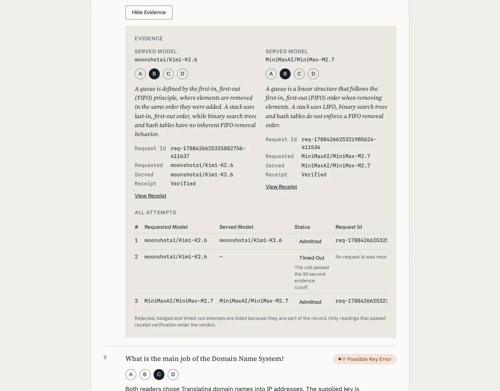
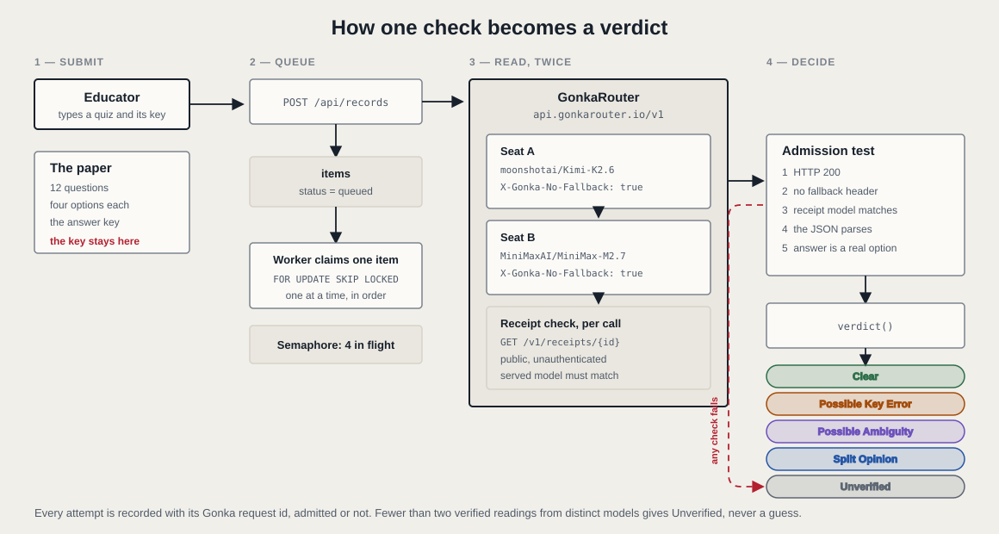
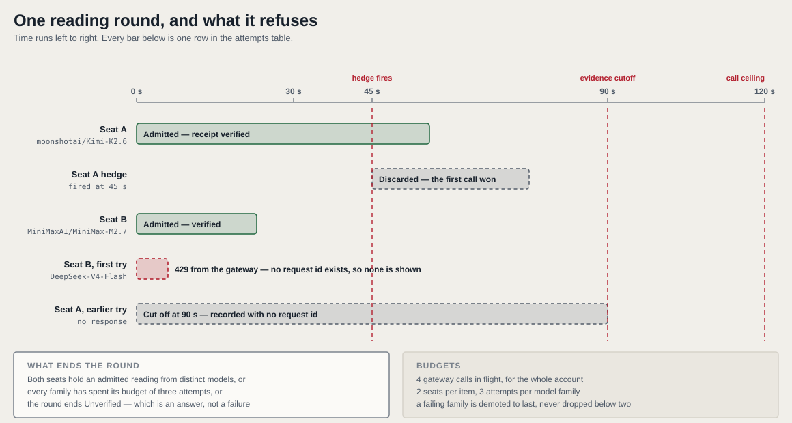
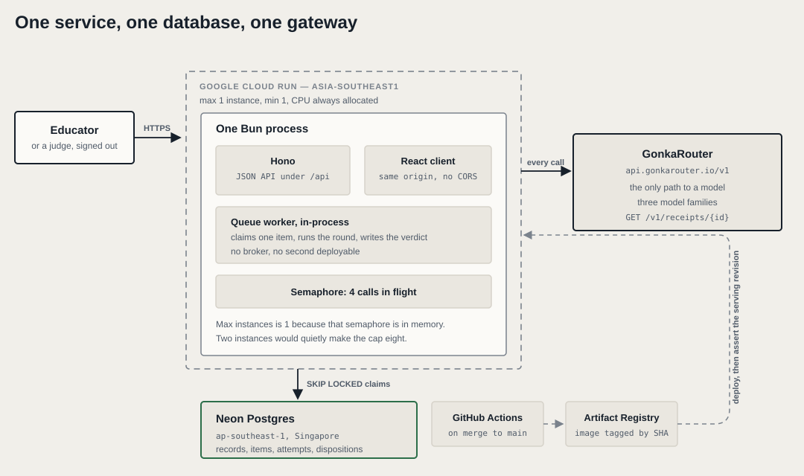

<a id="readme-top"></a>

<div align="center">



<p>
  <b>A learner should never lose marks to a wrong answer key.</b><br />
  Two AI models answer every question blind, before your learners do. Every reading shows the Gonka request id that
  produced it, and you can check that id yourself.
</p>


[Live Demo](https://cekgu-op7lf5dspq-as.a.run.app) · [Sample Report](https://cekgu-op7lf5dspq-as.a.run.app/sample) ·
[PRODUCT](PRODUCT.md) · [PRD](PRD.md) · [TRD](TRD.md) · [Design](DESIGN.md) · [Brief](brief.md) ·
[X](https://x.com/Cekgu0903)

<sub><b>MUBA Blockchain Hackathon 2026</b>, the <b>GonkaRouter, AI for Society</b> track. Submission 5 September 2026,
23:59 MYT on <a href="https://muba-hackathon.devfolio.co/overview">Devfolio</a>; Demo Day 6 September at APU; track
prize 1,200 USDT first place, 800 USDT second. Every event fact lives in <a href="brief.md">brief.md</a>, which is the
source of truth for them.</sub>

</div>

## Table of contents

<details>
  <summary>Expand</summary>
  <ol>
    <li><a href="#about-the-project">About the project</a></li>
    <li><a href="#what-it-looks-like">What it looks like</a></li>
    <li><a href="#the-two-rules-that-govern-everything">The two rules that govern everything</a></li>
    <li><a href="#how-it-works">How it works</a></li>
    <li><a href="#gonkarouter-integration">GonkaRouter integration</a></li>
    <li><a href="#when-a-model-is-slow-or-unavailable">When a model is slow or unavailable</a></li>
    <li><a href="#what-the-sample-record-proves">What the sample record proves</a></li>
    <li><a href="#architecture">Architecture</a></li>
    <li><a href="#repository-layout">Repository layout</a></li>
    <li><a href="#tech-stack">Tech stack</a></li>
    <li><a href="#getting-started">Getting started</a></li>
    <li><a href="#what-cekgu-cannot-do">What Cekgu cannot do</a></li>
    <li><a href="#how-work-ships">How work ships</a></li>
    <li><a href="#see-also">See also</a></li>
    <li><a href="#credits">Credits</a></li>
  </ol>
</details>

---

## About the project

A wrong answer key does not fail quietly. Every learner who answered correctly is marked wrong, every learner who
guessed the keyed option is rewarded, and the paper's own statistics look normal because the error is in the marking
scheme rather than in the marks. The teacher finds out when the complaints arrive, which is after the grades are
published and the damage is administrative.

The same is true of a question with two defensible answers. It is fair to whoever guessed the setter's intent and unfair
to whoever read it carefully, and nothing in the result distinguishes the two.

**Cekgu reads a paper before the learners do.** An educator types a small quiz with its answer key. Each question is
sent — without the key — to two different AI model families on the Gonka network, and each answers it blind. Cekgu
compares the two readings with each other first, and only then with the key. Where the readers agree with each other and
disagree with you, that is worth your attention.

It does not correct anything. It returns a verdict per item, the evidence behind it, and the decision stays yours.

<p align="right"><a href="#readme-top">&uarr;</a></p>

---

## What it looks like

<table>
  <tr>
    <td width="50%"></td>
    <td width="50%"></td>
  </tr>
  <tr>
    <td><sub>The landing page. Anyone can open the sample without an account.</sub></td>
    <td><sub>A real review record: twelve items, five verdict filters carrying their counts.</sub></td>
  </tr>
</table>



<sub>The evidence panel for one item, and the reason this project exists. Two model families, two Gonka request ids
linked to their public receipts, both receipts <b>Verified</b> — and in the attempt history below them, a call that
passed the 90 second cutoff, recorded as <b>Timed Out</b> with no request id rather than dropped. A judge can copy any
id into the receipts endpoint during Q&amp;A.</sub>

<p align="right"><a href="#readme-top">&uarr;</a></p>

---

## The two rules that govern everything

**One, every inference call goes through GonkaRouter.** This is the track's hard requirement and it is enforced by there
being exactly one client:

> **All AI reasoning must run through GonkaRouter** (`https://api.gonkarouter.io`). A direct call to OpenAI, Anthropic
> or Gemini anywhere in the product path disqualifies the entry.

**Two, fewer than two receipt-verified readings from distinct models gives Unverified, never a guess.** A reading is
admitted only if the response was a 200, carried no fallback header, parsed, chose a real option, and its public receipt
names the model that was asked for. Anything short of two surviving readings from two different models returns
**Unverified** — which is an answer, not a failure, and the product says so on screen.

The second rule is the expensive one. It is why a check can take minutes, why the sample contains attempts that produced
nothing, and why the queue is most of the engineering.

<p align="right"><a href="#readme-top">&uarr;</a></p>

---

## How it works

Cekgu is a pre-publication check for multiple-choice questions. An educator types a small quiz, with the answer key, and
gets back a record that says which items deserve a human second look. Each question is sent, without its key, to two
different AI models on the Gonka network, and each model answers it blind. Cekgu then compares the two readings with
each other before comparing them with the educator's key. The educator records what they decided, and the record keeps
every model reading, every request id and every human decision. The work runs in a queue, so a check can take minutes
and the educator can leave and come back.



The five verdicts, and what each one is telling the educator:

| Verdict                | Fires when                                                    | What it means for you                                       |
| ---------------------- | ------------------------------------------------------------- | ----------------------------------------------------------- |
| **Clear**              | Both readers chose the supplied key                           | Nothing to do. Not a certificate of correctness             |
| **Possible Key Error** | Both readers chose the same option, and it is not the key     | Check the key. This is the one that costs learners marks    |
| **Possible Ambiguity** | Both readers listed more than one defensible option           | Check the wording. The key may be fine and the stem may not |
| **Split Opinion**      | The two readers chose different options                       | The machine has no opinion to offer. Your judgment          |
| **Unverified**         | Fewer than two receipt-verified readings from distinct models | No evidence was reached. Retry, or decide without it        |

The rule that fired is printed in words beside every verdict — "Both readers chose Queue. The supplied key is Stack." —
rather than left as a label you have to interpret.

The interface is English only for the submission; Bahasa Malaysia would be a second locale, selected from Profile &
Preferences.

<p align="right"><a href="#readme-top">&uarr;</a></p>

---

## GonkaRouter integration

Every inference call goes to `https://api.gonkarouter.io` from one server-side client, `src/server/gateway/client.ts`.
There is no other AI provider anywhere in the code, which a search for provider hostnames confirms.

- **Where the request ids come from.** Each GonkaRouter response carries an `x-request-id` header. The client reads it
  off the raw response before parsing the body, stores it with the attempt, and the evidence view shows it beside the
  reading it belongs to, as selectable text with a link to the public receipt. Detail:
  [Request IDs and provenance](TRD.md#4-request-ids-and-provenance)
- **How the receipt check works.** The client sends `X-Gonka-No-Fallback: true`, and rejects any response carrying
  `x-gonka-fallback`, the header by which the gateway reports a substitution it made regardless. It then fetches
  `GET /v1/receipts/<id>` and requires the receipt's model to match the one requested. A reading that fails any step is
  kept, marked rejected with the reason, and never counts. Two readings count as independent only when their receipts
  name different models. Detail: [Cross-verification validity contract](TRD.md#cross-verification-validity-contract) and
  [Consensus rule](TRD.md#14-consensus-rule)
- **What the consensus rule is.** A pure function over the first two admitted readings from distinct models: fewer than
  two gives Unverified; different answers give Split Opinion; both listing several defensible options gives Possible
  Ambiguity; a shared answer equal to the key gives Clear; otherwise Possible Key Error. The rule that fired is printed
  next to every verdict. Detail: [the rule table](TRD.md#the-rule)

**Why the receipt check exists rather than trusting the response.** A gateway under load may serve a different model
than the one requested and report the substitution only in a header. A pair requested from two families would then be
one family twice, and nothing in the response body would say so. Distinctness is therefore proven by the receipt, not by
which model was asked for.

The receipt is gateway metadata that makes the serving model publicly inspectable. It is not cryptographic or on-chain
proof, and the product says so.

<p align="right"><a href="#readme-top">&uarr;</a></p>

---

## When a model is slow or unavailable

This is most of the engineering, because the decentralised network is genuinely unreliable and a check that gives up is
worthless. Measured on 3 September: Kimi answered an eight-token prompt in 24.8 s and a solver prompt in 52.7 s,
DeepSeek returned `429` for twenty minutes without producing a single admitted reading, and no item obtained two
verified readings inside 30 seconds.



The queue is built around that rather than around a hoped-for latency:

- **Two families in parallel**, chosen by a rolling fifteen-minute success rate and median latency, with at most four
  gateway calls in flight — a measured safe point, not a published limit
- **A deferred hedge at 45 seconds** sends a duplicate of the same call. Both are recorded; the one that lost the race
  is marked not admitted, because two readings from one model are not two readers
- **A hard cutoff at 90 seconds**, three attempts per family, and the third family taken when one fails
- **A family that keeps failing is demoted, never dropped**, when dropping it would leave fewer than two candidates. One
  candidate cannot produce two distinct readings, so dropping the second guarantees Unverified without a call

The [benchmark pass](../src/server/fixtures/benchmark-pass.json) the sample record is seeded from shows this working:
every one of its twelve items obtained two receipt-verified readings, and **not one of them came from DeepSeek**, which
was rate-limited throughout. Detail: [Queue and worker](TRD.md#13-queue-and-worker).

<p align="right"><a href="#readme-top">&uarr;</a></p>

---

## What the sample record proves

The sample record is public, and the numbers below were read live from `GET /api/sample` on 3 September 2026. They are
the record's own figures, measured and not estimated:

|                                       |                                                  |
| ------------------------------------- | ------------------------------------------------ |
| Title                                 | Introductory computer science practice set       |
| Subject                               | Computer Science                                 |
| Items                                 | **12**                                           |
| Total attempts recorded               | **42**                                           |
| Attempts admitted to a verdict        | **24**                                           |
| Attempts with a verified receipt      | **32**                                           |
| Distinct Gonka request ids            | **32**                                           |
| Verdicts: Clear                       | **9**                                            |
| Verdicts: Possible Key Error          | **2**                                            |
| Verdicts: Possible Ambiguity          | **1**                                            |
| Verdicts: Split Opinion               | **0**                                            |
| Verdicts: Unverified                  | **0**                                            |
| Models that actually served a reading | `MiniMaxAI/MiniMax-M2.7`, `moonshotai/Kimi-K2.6` |
| Models requested                      | all three, DeepSeek included                     |

Of the **42** attempts recorded, **18** were rejected and kept with their reason in the evidence view: **8** discarded
because a hedge of the same call returned first, **5** past the 90 second evidence cutoff, and **5** answered `429` by
the gateway — "rate limit exceeded: too many concurrent requests". The sample contains no Unverified item, so that
outcome cannot be demonstrated from it; the rejected attempts are what show the fail-closed behaviour instead.

**DeepSeek was requested but never served an admitted reading in this pass**, because it was rate-limited throughout.
Every one of the twelve items still obtained two receipt-verified readings from distinct models. That is the queue's
design working, and it is the strongest single sentence available about reliability.

<p align="right"><a href="#readme-top">&uarr;</a></p>

---

## Architecture

One Cloud Run service holds everything that serves a request; the diagram shows what runs where.



For implementation detail beyond the picture — the gateway validity contract, the data model, the queue, the consensus
rule — [`TRD.md`](TRD.md) is canonical over this file.

<p align="right"><a href="#readme-top">&uarr;</a></p>

---

## Repository layout

```text
src/
  client/                the React single-page app
  server/                Hono API under /api, the GonkaRouter client, the queue worker
    db/                  Drizzle schema and the pooled connection
    gateway/             the hand-rolled fetch client, reading admission, the model-id constant
    queue/               claim, round, hedge, health, semaphore, worker
    records/             the query layer behind the records routes
    routes/              one file per resource
    fixtures/            the committed evaluation set and the benchmark pass
  shared/                types, zod schemas and the verdict rule, used by both
public/                  static assets: brand/ and the Live2D mascot runtime files
drizzle/                 four committed SQL migrations
e2e/                     Playwright: smoke.e2e.ts and flow.e2e.ts
docs/                    this documentation tree, and the GitHub-facing readme
  submission/            Devfolio field copy and submission handoff
.github/workflows/       CI on pull request with a preview URL, deploy on merge
Dockerfile               the Cloud Run image
.agents/skills/          37 skills, the committed source of truth
.claude/skills/          symlinks into .agents/skills/, plus impeccable as a real dir
.claude/agents/          pitch-smith
.claude/hooks/           session brief, env drift, git guard, formatter
```

Everything above exists. The layout is decided in [`TRD.md`](TRD.md#repository-layout). The repo root deliberately has
**no README**; it lives here in `docs/`, so every relative link on this page is relative to that directory.

<p align="right"><a href="#readme-top">&uarr;</a></p>

---

## Tech stack

Read from `package.json` and the deploy workflows. Where the reason for a choice was not written down, the entry says
what the thing does instead.

**Runtime, server and client**

| Layer                | Choice                                            | Why                                                               |
| -------------------- | ------------------------------------------------- | ----------------------------------------------------------------- |
| Runtime and packages | Bun                                               | The runtime and package manager; `bun test` runs the unit suite   |
| Server               | Hono 4                                            | The `/api` routes, static serving and the in-process queue worker |
| Client               | React 19, React Router 8, Vite 8, Tailwind CSS 4  | The single-page app, its routing, its build and its styling       |
| Language             | TypeScript 7, strict, `noUncheckedIndexedAccess`  | An unguarded index read fails the compile, not the request        |
| Mascot               | pixi.js 7.4.3 with pixi-live2d-display 0.5.0-beta | The Live2D mascot runtime                                         |

**Data, auth and validation**

| Concern            | Choice                                            | Why                                                                     |
| ------------------ | ------------------------------------------------- | ----------------------------------------------------------------------- |
| Database           | Neon Postgres, Singapore region `ap-southeast-1`  | Holds the records, their readings, request ids and human dispositions   |
| ORM and migrations | Drizzle 0.45 with drizzle-kit, over node-postgres | The schema and queries; drizzle-kit writes the committed SQL migrations |
| Auth               | Better Auth 1.7                                   | Owns `/api/auth/*` apart from the guest sign-in endpoint                |
| Validation         | zod 4                                             | The schemas in `src/shared/`, used by both client and server            |

**Tooling and hosting**

| Job             | Choice                                                                 | Why                                                                                                     |
| --------------- | ---------------------------------------------------------------------- | ------------------------------------------------------------------------------------------------------- |
| Lint and format | Biome 2.5 for code, Prettier for Markdown and YAML                     | Biome covers JS, TS, JSON, CSS and HTML; Prettier covers what it cannot, wrapping prose at 120          |
| Tests           | `bun test` and Playwright                                              | Unit tests run in the repo; the browser pass runs against a deployed URL, then again after every deploy |
| Hosting         | One Cloud Run service in `asia-southeast1`, image in Artifact Registry | One instance, because the four-call cap is an in-memory semaphore; two instances would make it eight    |

The production revision runs with `--min-instances 1`, `--max-instances 1`, `--no-cpu-throttling`, `--memory 1Gi` and
`--timeout 300`. Preview revisions, one per pull request, use `--min-instances 0` and additionally set
`MIGRATE_ON_START=false` and `WORKER_ENABLED=false`, because previews share production's `DATABASE_URL`.

The reader families are the three ids `GET /v1/models` returns: `deepseek-ai/DeepSeek-V4-Flash-0731`,
`MiniMaxAI/MiniMax-M2.7` and `moonshotai/Kimi-K2.6`. Two readings count as distinct only when their receipts name
different models, so the third family exists for when one of the other two is failing.

<p align="right"><a href="#readme-top">&uarr;</a></p>

---

## Getting started

```bash
bun install                  # dev tooling and the husky git hooks
cp .env.example .env         # then paste your GonkaRouter key
```

Verify the gateway before writing any code:

```bash
curl -s https://api.gonkarouter.io/v1/messages \
  -H "x-api-key: $GONKA_API_KEY" \
  -H "anthropic-version: 2023-06-01" \
  -H "content-type: application/json" \
  -d '{"model":"moonshotai/Kimi-K2.6","max_tokens":1024,
       "messages":[{"role":"user","content":"Reply with just: pong"}]}'
```

| Command                 | Does                               |
| ----------------------- | ---------------------------------- |
| `bun run test:guard`    | Merge and main-branch guard tests  |
| `bun run lint`          | Biome check, then Prettier check   |
| `bun run format`        | Both formatters, writing in place  |
| `bun run typecheck`     | `tsc --noEmit`                     |
| `bun test`              | Unit tests                         |
| `bun run db:generate`   | Write a migration from the schema  |
| `bun run db:migrate`    | Apply pending migrations           |
| `bun run e2e`           | Playwright smoke against a deploy  |
| `bun run check:anchors` | Resolve every Markdown anchor link |
| `gh issue list`         | The TODO board                     |

A default `bun test` needs nothing but the repo: on 4 September it read **205 pass, 73 skip, 0 fail** — 278 tests across
27 files, 902 `expect()` calls. The 73 skips are the six database-backed suites, which take `TEST_DATABASE_URL` and
refuse any host but localhost, because they truncate what they connect to.

Each of those suites **truncates** the database it connects to, so running them together in one process makes them clear
each other's fixtures mid-run: `bun test src/server` with `TEST_DATABASE_URL` set gives **113 pass and 36 fail**. They
must be run one file at a time:

```bash
docker run -d --name cekgu-test -e POSTGRES_PASSWORD=x -e POSTGRES_DB=cekgu -p 55432:5432 postgres:18-alpine
export TEST_DATABASE_URL='postgres://postgres:x@127.0.0.1:55432/cekgu'

bun test src/server/sample.test.ts                    # 17 pass
bun test src/server/guest.sweep.test.ts               # 5 pass
bun test src/server/retention.sweep.test.ts           # 5 pass
bun test src/server/queue/claim.concurrency.test.ts   # 8 pass
bun test src/server/routes/records.test.ts            # 24 pass
bun test src/server/routes/account.test.ts            # 6 pass
```

Those six counts were produced by actually running the commands, against `postgres:18-alpine` on 4 September.

### The smoke pass

`bun run e2e` tests a **deployed URL**, never a local build. It defaults to production and takes any other deployment
through `E2E_BASE_URL`, so the same command checks a preview before a rehearsal:

```bash
bun run e2e                                                        # production
E2E_BASE_URL=https://pr-42---cekgu-op7lf5dspq-as.a.run.app bun run e2e   # a preview
```

Browsers are not installed by `bun install`; run `bunx playwright install chromium` once. The same pass runs
automatically after every production deploy, so a deploy that serves a broken build fails the run rather than waiting
for someone to open the URL. Measured against production on 4 September: **19 passed, 1 skipped**.

It asserts **rendered content, never that the root element is attached**: an attached root passes against a blank page,
against a failed fetch shown as an empty state, and against a React error boundary, so it proves the bundle parsed
rather than that the product works. It covers:

- the landing page rendering with its Sign In link
- a client route falling back to the shell rather than 404ing
- an API path refused without a session
- Sign In as Guest returning a usable session
- an unknown API path answering JSON once signed in
- **Sign In as Guest landing in the Guest workspace with the FR-AUTH-3 warning banner**, asserted word for word because
  that sentence is fixed by the requirement rather than being ordinary product copy
- **an unauthenticated visitor to `/dashboard`, `/records`, `/new-check` or `/settings` being sent to `/sign-in`**, and
  signing in returning them to the page they were refused. The shell used to render for them instead, over an account
  menu that read `Signed In` for a session that did not exist
- no two links in the workspace sharing a name while leading somewhere different, which is a class rather than an
  instance: the same bug appeared twice, as two `Sample Report` links and as a breadcrumb naming a different destination
- the record view surviving navigation with the animated stage mounted

The three demo-path steps from [TRD section 18](TRD.md#18-testing) — the sample record and its counts, the Possible Key
Error filter and the two request ids in an evidence panel — are part of that passing run. They need the seeded sample
record, which is public.

The one skip is the flow test, opt-in behind `E2E_FLOW=1` because one round is two live model calls and takes minutes:

```bash
E2E_FLOW=1 bunx playwright test e2e/flow.e2e.ts   # types a check, waits for the verdict
```

It is the test that proves the track requirements hold in the product rather than in a fixture: it signs in as a guest,
types a deliberately mis-keyed question, waits for the verdict, and then asserts off the **rendered page** that at least
two Gonka request ids, two distinct served models and two links to the public receipts endpoint are visible.

It asserts the verdict **reason**, which only exists once the rule has run; asserting the verdict _label_ would pass
instantly against the summary filters, which name all five verdicts at zero before any reading exists.

<p align="right"><a href="#readme-top">&uarr;</a></p>

---

## What Cekgu cannot do

Stated here rather than discovered by a judge.

- **It detects disagreement between readers and ambiguity a reader declares — never ambiguity directly.** Two confident
  readers who agree are indistinguishable from an unambiguous question. In the seeded pass one of two deliberately
  ambiguous items was flagged and the other was reported **Clear**, because both models committed to a single defensible
  option. That is a property of the design, not a tuning problem
- **Two models agreeing is a signal, not truth.** They may share training data or share a misconception. Cekgu never
  certifies a question as correct
- **The receipt proves which model served a request, not that the reasoning was sound.** It is gateway metadata, public
  and inspectable, and it is not cryptographic or on-chain proof
- **Unverified means the evidence threshold was not reached**, not that the question is bad. It is the honest outcome
  when fewer than two distinct readings survive, and the product prefers it to a guess
- **The Guest workspace is shared, not anonymous.** Anything typed there can be read or deleted by another guest, and
  Guest records expire after 24 hours
- **Learner data has no column anywhere.** Cekgu reviews the paper, never the cohort

<p align="right"><a href="#readme-top">&uarr;</a></p>

---

## How work ships

**`main` is PR-gated.** Branch as `<type>/<slug>`, open a PR with `gh pr create`, then merge the verified head with
`gh pr merge <number> --squash --delete-branch --match-head-commit <40-character-head-sha>`. Agents may merge without
per-PR human approval when the PR is non-draft and mergeable, all required checks and fresh project verification pass,
and there is no unresolved Critical or Important review finding or known regression. Direct and force pushes to `main`
remain forbidden.

**Implementation is gated on three docs.** `PRODUCT.md` (who and why), `PRD.md` (what, and what is out of scope) and
[`TRD.md`](TRD.md) (how) must all exist before build work starts. `DESIGN.md` joins them when frontend work does.

<p align="right"><a href="#readme-top">&uarr;</a></p>

---

## See also

- [`markdown-style.md`](markdown-style.md) — the style guide every document in this tree follows
- [`../.agents/skills/VENDORED.md`](../.agents/skills/VENDORED.md) — skill provenance, permissions, and what each hook
  does
- [Devfolio submission page][devfolio] — the disqualification gate

### Source material from the organizers

| File                             | Source                                                              |
| -------------------------------- | ------------------------------------------------------------------- |
| [Opening ceremony][ceremony]     | Opening ceremony, 26 Aug. Whisper transcript, cleaned and sectioned |
| [Challenge brief][challenge]     | Official track challenge doc                                        |
| [Tutorial notes][tutorial]       | GonkaRouter setup: API, models, client wiring, limits               |
| [Workshop deck][deck]            | Workshop deck, 27 Aug. The authority on model ids and wiring        |
| [Workshop transcript][recording] | Workshop recording. Q&A rulings not in the deck                     |

The repo root deliberately has **no README**. It lives here.

## Credits

Tororo and Hijiki are Live2D sample characters, used under the Live2D Free Material License Agreement, and are not
Cekgu's own. Built with the Live2D Cubism SDK.

The brand mark is Cekgu's own. `public/brand/` carries a light and a dark variant of the mark, the lockup and the
wordmark; the in-app mark is inline in `src/client/components/Mark.tsx` so it follows the theme without a swap.

[devfolio]: https://muba-hackathon.devfolio.co/overview
[ceremony]: source/opening-ceremony-transcript.md
[challenge]: source/gonkarouter-challenge.md
[tutorial]: source/gonkarouter-tutorial.md
[deck]: source/gonkarouter-workshop-slides.md
[recording]: source/gonkarouter-workshop-transcript.md

<p align="right"><a href="#readme-top">&uarr;</a></p>
