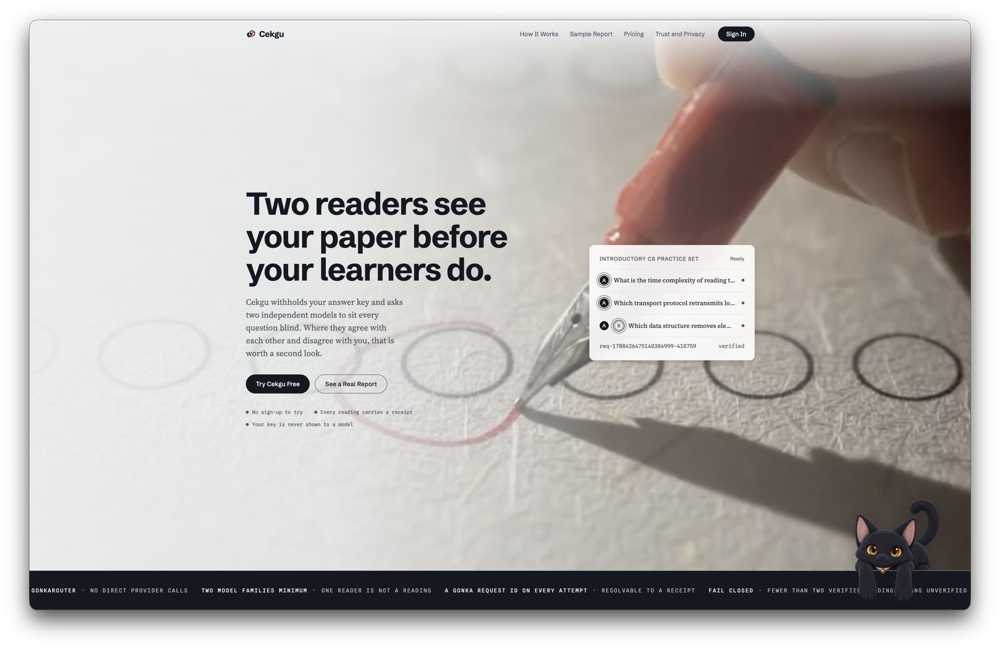
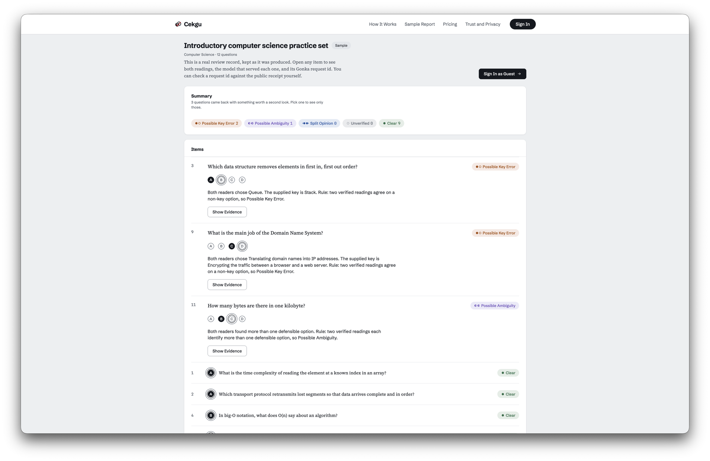
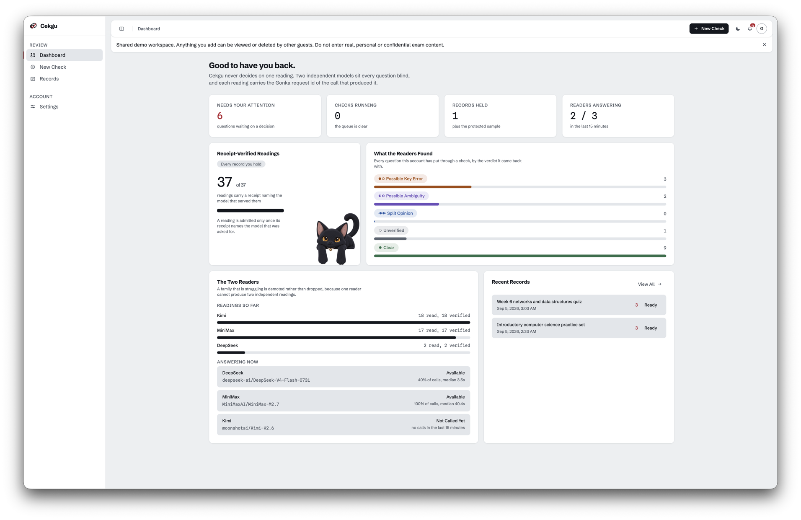
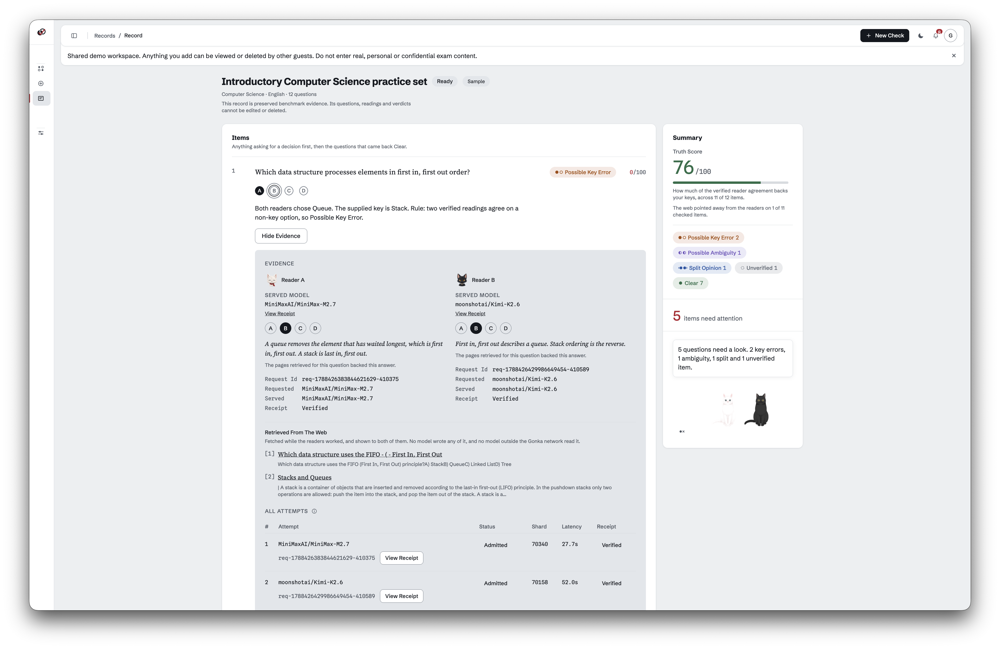
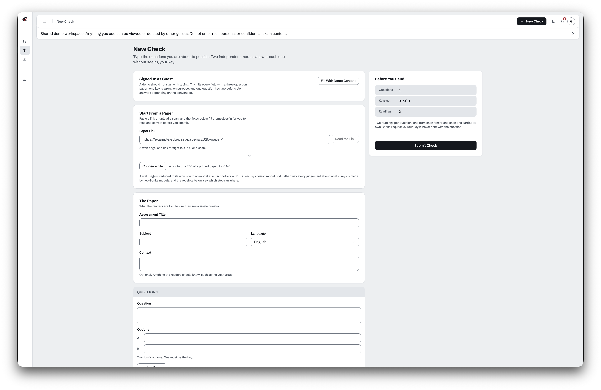
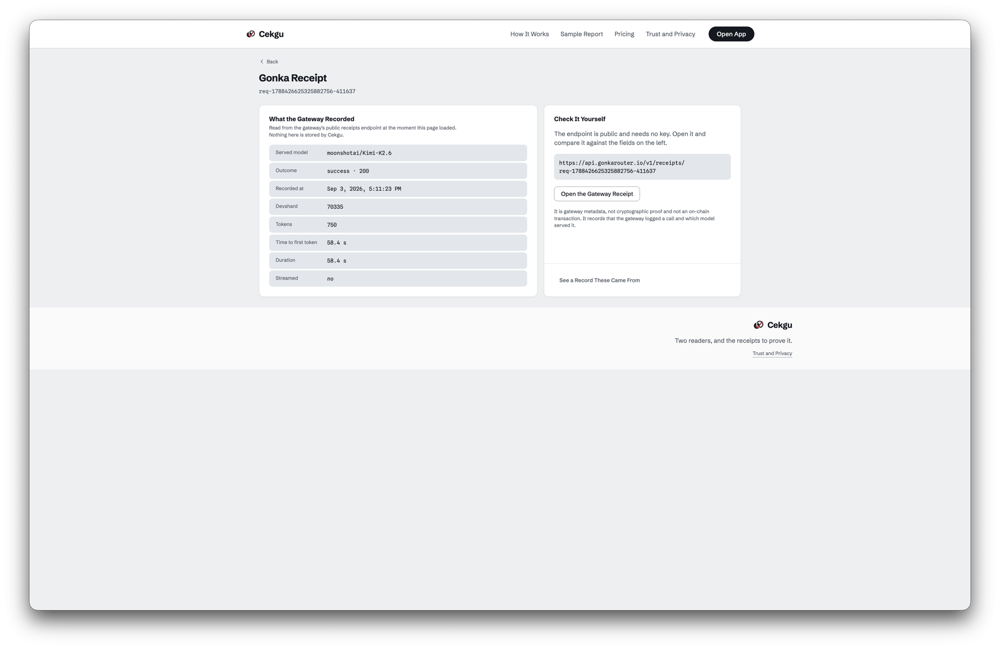
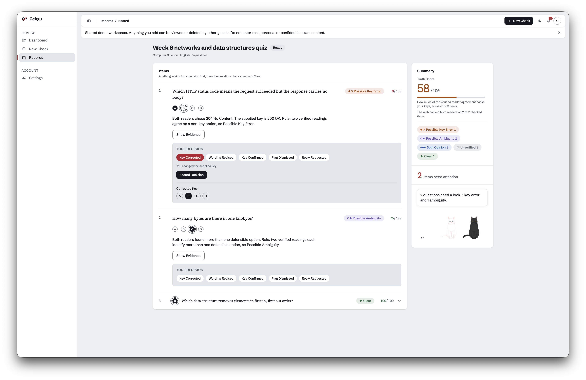
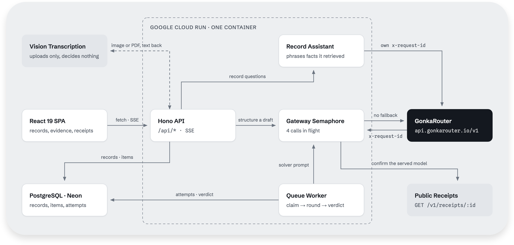

<a id="readme-top"></a>

<!-- PROJECT LOGO -->

<br />
<div align="center">
  <a href="https://github.com/MUBA-M1KU/Cekgu">
    
  </a>

  <h3>Cekgu</h3>

  <p>
    Two AI readers solve a multiple-choice paper without seeing its answer key, and every reading they are allowed to use carries a Gonka Request ID a judge can look up.
    <br />
    <a href="https://cekgu-op7lf5dspq-as.a.run.app"><strong>Live Demo »</strong></a>
    &middot;
    <a href="https://cekgu-op7lf5dspq-as.a.run.app/sample">Sample Report</a>
    &middot;
    <a href="https://x.com/Cekgu0903">X</a>
    <br />
  </p>

[![Bun][Bun]][Bun-url] [![Hono][Hono.dev]][Hono-url] [![React][React.js]][React-url]
[![TypeScript][TypeScript]][TypeScript-url] [![Tailwind CSS][Tailwind]][Tailwind-url]
[![PostgreSQL][Postgres]][Postgres-url] [![Drizzle][Drizzle]][Drizzle-url] [![Cloud Run][CloudRun]][CloudRun-url]
[![GonkaRouter][GonkaRouter]][GonkaRouter-url]

</div>

<!-- TABLE OF CONTENTS -->

## Table of Contents

<details>
  <summary>Expand</summary>
  <ol>
    <li>
      <a href="#about-the-project">About The Project</a>
      <ul>
        <li><a href="#demo-video">Demo Video</a></li>
        <li><a href="#screenshots">Screenshots</a></li>
        <li><a href="#how-it-works">How It Works</a></li>
        <li><a href="#features">Features</a></li>
        <li><a href="#architecture">Architecture</a></li>
        <li><a href="#tech-stack">Tech Stack</a></li>
      </ul>
    </li>
    <li>
      <a href="#getting-started">Getting Started</a>
      <ul>
        <li><a href="#prerequisites">Prerequisites</a></li>
        <li><a href="#installation">Installation</a></li>
      </ul>
    </li>
    <li><a href="#roadmap">Roadmap</a></li>
    <li><a href="#team">Team</a></li>
    <li><a href="#license">License</a></li>
    <li><a href="#acknowledgments">Acknowledgments</a></li>
  </ol>
</details>

<!-- ABOUT THE PROJECT -->

## About The Project

A mis-keyed question rewards the learner who guessed and penalises the one who understood. A question with two
defensible options does the same thing more quietly. Both are usually found after the paper has been sat, from the
complaint rather than from the paper.

Cekgu puts one evidence step in front of that. An educator submits a small multiple-choice paper with its answer key.
Two different model families solve each question through GonkaRouter, neither of them shown the key, and a fixed rule
compares the two readings with each other before it ever compares them to the key. The educator gets a verdict, the
sentence of the rule that produced it, both readers' own reasoning, and the request ids to check the readings actually
happened.

The scope is deliberately narrow. Cekgu flags disagreement between two readers and ambiguity a reader declares. It does
not mark a paper, does not certify a question as correct, and does not prove a question is unambiguous. Two confident
readers who agree are indistinguishable from an unambiguous question, and the sample record carries a real instance of
that: a question written to be ambiguous came back **Clear** because both readers committed to the same single answer.
The product is built for practice papers and synthetic examples, not for confidential or unreleased examinations.

<p align="right"><a href="#readme-top">&uarr;</a></p>

### Demo Video

<video src="https://github.com/user-attachments/assets/09f7f9f2-9757-4d40-8aa3-0973fe5ee2b2" controls muted poster="assets/demo-poster.jpg" width="100%">
  Your browser does not support inline video playback.
  <a href="https://github.com/MUBA-M1KU/Cekgu/releases/download/demo-video-v1/Cekgu-Demo-720p.mp4">Download the film</a> instead.
</video>

<p align="right"><a href="#readme-top">&uarr;</a></p>

### Screenshots

<table>
  <tr>
    <td width="50%"></td>
    <td width="50%"></td>
  </tr>
  <tr>
    <td><sub>The landing page, signed out.</sub></td>
    <td><sub>The public sample report, readable without an account.</sub></td>
  </tr>
  <tr>
    <td width="50%"></td>
    <td width="50%"></td>
  </tr>
  <tr>
    <td><sub>The dashboard: verified readings against total, the verdict breakdown, and each family's share of the work.</sub></td>
    <td><sub>Item evidence: two served models, two request ids, receipt states, and the attempts that were refused.</sub></td>
  </tr>
</table>

<p align="right"><a href="#readme-top">&uarr;</a></p>

### How It Works

1. **Enter a paper.** Type the questions, options and key into **New Check**, paste a link to a page that already has
   them, or upload a scan or photograph — and edit the draft that comes back. No draft ever submits itself; each one is
   corrected and sent by the educator.

   

1. **Two families read it blind.** Each question is queued. A round takes two seats and fills each from a different
   model family through GonkaRouter. The prompt carries the stem, the lettered options, the subject and the language —
   never the supplied key, and never the other reader's output.

1. **Evidence is admitted, not assumed.** A reply becomes a usable reading only if the call returned 200, carried no
   fallback header, parsed as the requested JSON, answered with a letter that is actually an option, and matched a
   public Gonka receipt naming the same model that was requested. Anything else is written down as a refused attempt
   with the reason, and takes no part in the verdict.

   

   Every request id in the product opens this page, and the gateway URL on it is public and needs no key — so the claim
   can be checked against the gateway rather than taken from us.

1. **One rule decides.** The first two admitted readings from distinct served models go through a five-outcome rule in a
   fixed order. The order is the design: disagreement before ambiguity, ambiguity before the key.

   | Verdict                | Fires when                                                                    |
   | ---------------------- | ----------------------------------------------------------------------------- |
   | **Unverified**         | Fewer than two distinct receipt-verified readings survived. No verdict given. |
   | **Split Opinion**      | The two readers committed to different options.                               |
   | **Possible Ambiguity** | Both readers named more than one option as defensible.                        |
   | **Clear**              | Both readers chose the supplied key.                                          |
   | **Possible Key Error** | Both readers agreed on the same option, and it is not the key.                |

1. **A score puts a number on it.** The same two readings produce a Truth Score from 0 to 100, shown on the record and
   on every item. A reader's commitment to an option is worth half the weight and the rest is split across the options
   it would still defend, so a hedge costs the key something without erasing the commitment. It is computed in
   `src/shared/truth-score.ts` from readings already on the record — no extra inference call, and no model asked how
   confident it feels, because a model's report about itself is not evidence and no receipt could back it.

   The number says how much of the verified reader agreement backs the supplied key. It is not a claim that the question
   is correct. An **Unverified** item scores null rather than 0: 0 is what two readers agreeing against the key earns,
   and an item nobody could read has not earned it. The record figure always prints its own denominator, because three
   verified items out of twelve can average 100 and printing that alone would describe nine items nobody read.

1. **A human decides.** The verdict is an attention signal, not a mark. The educator records what they did about it:
   corrected the key, revised the wording, confirmed the key, dismissed the flag, or asked for a retry. That decision is
   stored with the item.

   

<p align="right"><a href="#readme-top">&uarr;</a></p>

### Features

**The GonkaRouter integration.** The track's four requirements are enforced in code, not asserted in prose.

- **One inference path.** `src/server/gateway/client.ts` is the only file that calls a model for reasoning, and
  `src/server/gateway/only-gonkarouter.test.ts` fails the build if a provider hostname or SDK appears anywhere in `src/`
  outside the two documented provider directories named below.
- **Two families, proven distinct by receipt.** A verdict needs two admitted readings whose **served** models differ.
  Distinctness is taken from the receipt the gateway wrote, never from the model that was requested, so two calls to one
  family can never be counted as two readers.
- **No silent substitution.** Every call sends `X-Gonka-No-Fallback: true`, and any reply carrying an `X-Gonka-Fallback`
  header is refused even when its body is a perfectly good completion.
- **Request ids in the product.** Each reading shows its Gonka Request ID, devshard, requested model, served model and
  receipt state, as selectable text. `/receipt/:requestId` reads the receipt back live through the server, because the
  gateway sends no CORS header and a browser cannot fetch it directly. The receipt viewer distinguishes a receipt that
  does not exist from a gateway it could not reach.
- **Explicit consensus.** The five-outcome rule above is a pure function in `src/shared/verdict.ts` with the reason
  sentence it produced shown next to the verdict. The Truth Score beside it is a second pure function over the same two
  readings, so a score can never disagree with the verdict printed next to it.

**The checking pipeline.**

- Every attempt is recorded, admitted or refused — a timeout, a 429, a receipt mismatch and a fallback all leave a row
  with its own reason, and the evidence panel shows them under the two readings.
- Bounded concurrency: a Postgres `SKIP LOCKED` claim per item, at most four calls in flight against the gateway
  account, three attempts per family, and a deferred hedge that duplicates a call only after 45 seconds.
- Model health is tracked over a rolling 15-minute window. A family with three failures and nothing successful behind it
  is demoted rather than dropped, because dropping it can leave a round with one candidate and a guaranteed
  **Unverified**.
- Reasoning content is cleaned before comparison: `<think>` blocks are stripped, and each prompt carries a nonce so the
  gateway cache cannot serve one inference under two request ids.
- A record streams its progress over SSE, so a queued paper fills in without a refresh.

**The product around it.**

- A public sample report, readable signed out, seeded from a real recorded benchmark pass — 12 questions, 42 attempts,
  24 of them admitted, captured 3 September 2026 with the request ids intact.
- Guest sign-in into one shared workspace for anyone who wants to try it without an account; guest records expire after
  24 hours.
- Email and password accounts, plus Google sign-in when the deployment is configured with an OAuth client.
- A dashboard that counts verified readings against total readings for the account, and each family's share of the work
  by served model.
- A pasted link, fetched and reduced to the words on the page by a parser that calls no model at all, then structured
  into a draft by a Gonka model. It is the only input that reaches nothing outside the Gonka network, so it works on a
  deployment with no vision key. Links resolving inside a private network are refused before a socket opens, which
  matters on Cloud Run where `169.254.169.254` hands out service-account tokens.
- Upload of PNG, JPEG, WebP or PDF up to 10 MB, transcribed to text and then structured into a draft by a Gonka model.
- An optional Live2D mascot, off unless `MASCOT_ENABLED=true`, which respects Reduce Motion and falls back to a still
  image when WebGL is unavailable.

<p align="right"><a href="#readme-top">&uarr;</a></p>

### Architecture

<p align="center">
  
</p>

The browser talks to one Hono process on Cloud Run that serves both the API and the built client. Accounts, records,
attempts and decisions live in PostgreSQL; the attempts table is the evidence trail, holding the request id, devshard,
requested and served model, receipt JSON, latency and rejection reason for every call ever made about an item.

Checking is asynchronous because a decentralised network is sometimes slow and sometimes unavailable. The worker loop
claims one queued item at a time, runs its round, writes the verdict and moves on; a claim that outlives its 15-minute
lease is released so a Cloud Run restart cannot strand a question. When evidence is insufficient the pipeline fails
closed to **Unverified** and says so, rather than manufacturing a second opinion.

**The one call that does not go to GonkaRouter**, and the one that no longer has to. Both are named here rather than
left to be found, because a boundary a reader has to discover is worse than the boundary itself.

_Transcription decides nothing._ An uploaded image or PDF is sent to a vision model to transcribe the words already
printed on it. It is forbidden by its own prompt from answering a question, marking an option correct, or supplying a
key that is not printed, and it creates no record. Every judgement about what those words mean is made afterwards by
Gonka models carrying request ids. The measured rationale is in
[TRD section 20](TRD.md#20-reading-a-paper-from-an-upload).

_The record assistant runs on the gateway._ Asking the cats about a record was briefly phrased off-gateway, and that was
the more serious of two exemptions — answering a question about a record sits closer to reasoning than transcription
does. It no longer is. `CHAT_PROVIDER` defaults to `gonka`, the assistant's own inference goes to MiniMax-M2.7 through
GonkaRouter like every other reasoning step, and **its turn carries a real `x-request-id` with a public receipt** rather
than a provider response id. Measured on production at 06:35 on 5 September: two tool calls and an answer in 15 s,
`req-1788590155239980984-1077255`.

Four things hold, and all of them are checkable in the code:

- Every fact it states is retrieved by pure functions in [`src/server/chat/`](../src/server/chat/) from readings two
  Gonka models produced, each carrying an `x-request-id` and a public receipt. The model phrases those facts and is
  forbidden from adding one
- Citations are resolved server-side against the loaded record, never trusted from the model, and one that does not
  resolve is dropped rather than rendered — so an invented request id never becomes a link a judge can click
- It may not adjudicate: it cannot say which option is correct, confirm or reject a key, or solve a question. Cekgu does
  not certify answers, and its assistant does not either. Asked "why is question 1 flagged?" on a question that is
  **Clear**, it says so instead of inventing a reason
- The off-gateway path still exists behind `CHAT_PROVIDER=gemini`, and if it is ever used the turn's id is labelled by
  provider and drawn as a visibly different object from a Gonka receipt — unlinked, because there is nothing to open

**Every blind read, every verdict, every receipt and every answer in this product is GonkaRouter's.** Two directories
may name a provider hostname: `src/server/transcribe/`, which is used, and `src/server/chat/`, whose off-gateway client
is dormant because `CHAT_PROVIDER` defaults to `gonka`. The test named above fails the build if that list widens, if
either directory imports the verdict rule or the record writer, or if a provider hostname reaches the reasoning path at
all. [TRD section 21](TRD.md#21-the-readers-voice-and-the-record-assistant) holds the decision and its reasoning.

<p align="right"><a href="#readme-top">&uarr;</a></p>

### Tech Stack

| Layer          | Technology                                     | Role                                                             |
| -------------- | ---------------------------------------------- | ---------------------------------------------------------------- |
| Runtime        | Bun 1.4                                        | Server runtime, package manager, test runner                     |
| Server         | Hono, Zod                                      | API, boundary validation, SSE                                    |
| Client         | React 19, React Router 8, Vite 8, Tailwind 4   | Review workspace, evidence views, public pages                   |
| Data           | PostgreSQL (Neon), Drizzle ORM and Drizzle Kit | Records, items, attempts, dispositions, model health, migrations |
| Auth           | Better Auth                                    | Email and password, Google OAuth, shared Guest workspace         |
| Inference      | GonkaRouter                                    | Blind reads, draft structuring, receipts — all reasoning         |
| Transcription  | Vision model, uploads only                     | Printed text from an image or PDF, no judgement                  |
| Assistant      | GonkaRouter, MiniMax-M2.7 with tool calling    | Grounded answers about one record, with receipts                 |
| Mascot         | PixiJS, pixi-live2d-display, Web Speech        | Live2D reader seats, their captions and their voice              |
| Hosting and CI | Cloud Run, Artifact Registry, GitHub Actions   | Container build, tagged PR previews, production deploy           |
| Quality        | Biome, Prettier, TypeScript, Playwright        | Lint, format, strict types, browser smoke pass                   |

Implementation detail, API contracts, model measurements, queue policy and test evidence live in [TRD](TRD.md). Users,
scope and the business hypothesis live in [PRODUCT](PRODUCT.md), and the acceptance criteria in [PRD](PRD.md).

<p align="right"><a href="#readme-top">&uarr;</a></p>

<!-- GETTING STARTED -->

## Getting Started

The deployed app needs nothing installed: open the [live demo](https://cekgu-op7lf5dspq-as.a.run.app) and press **Sign
In as Guest**, or read the [sample report](https://cekgu-op7lf5dspq-as.a.run.app/sample) without signing in at all.

Running it locally needs a Postgres database and a GonkaRouter key, because there is no offline inference path and there
is not meant to be one.

<p align="right"><a href="#readme-top">&uarr;</a></p>

### Prerequisites

- [Bun](https://bun.sh) 1.4 or newer
- A PostgreSQL database, local or hosted
- A GonkaRouter API key from [gonkarouter.io](https://gonkarouter.io)
- Optional: a Google OAuth client for Google sign-in, and a vision API key to enable paper uploads. Without either, the
  app still runs — Google sign-in disappears and `POST /api/extract` answers 503 saying uploads are off. Pasting a link
  to a web page keeps working, because that path needs no vision model.

<p align="right"><a href="#readme-top">&uarr;</a></p>

### Installation

1. Install dependencies. This also wires the Husky commit hooks.

   ```sh
   bun install
   ```

1. Copy the environment template and fill it in. Key names only ever live in the example file, never values.

   ```sh
   cp .env.example .env
   ```

   | Variable                   | Required | Notes                                                              |
   | -------------------------- | -------- | ------------------------------------------------------------------ |
   | `GONKA_API_KEY`            | yes      | The only inference credential                                      |
   | `DATABASE_URL`             | yes      | Postgres connection string                                         |
   | `BETTER_AUTH_SECRET`       | yes      | Session signing secret                                             |
   | `GUEST_EMAIL`              | yes      | The shared Guest account, seeded on start                          |
   | `GUEST_PASSWORD`           | yes      | As above                                                           |
   | `GONKA_BASE_URL_OPENAI`    | no       | Defaults to `https://api.gonkarouter.io/v1`, `/v1` suffix included |
   | `BETTER_AUTH_URL`          | no       | Defaults to `http://localhost:8080`                                |
   | `PORT`                     | no       | Defaults to `8080`                                                 |
   | `GOOGLE_CLIENT_ID/_SECRET` | no       | Both must be set for Google sign-in to appear                      |
   | `MASCOT_ENABLED`           | no       | `true` turns on the Live2D readers                                 |
   | `MIGRATE_ON_START`         | no       | `false` skips migrations and sample seeding; PR previews set this  |
   | `WORKER_ENABLED`           | no       | `false` runs the API without the queue worker                      |

1. Apply the migrations.

   ```sh
   bun run db:migrate
   ```

1. Start both processes. The API runs on `8080` under Bun's watcher and Vite serves the client on `5173`, proxying
   `/api` to it.

   ```sh
   bun run dev
   ```

**Verifying a change.** The first three are what CI runs on every pull request.

```sh
bun run lint           # Biome across the code, Prettier across Markdown and YAML
bun run typecheck      # tsc --noEmit, strict, noUncheckedIndexedAccess
bun test               # 369 pass, 73 skip, 0 fail across 47 files
bun run e2e            # Playwright against the deployment named by E2E_BASE_URL
bun run check:anchors
```

`bun run e2e` points at the **deployed** URL by default, not your working tree — it prints its target on every run. Use
`bun run e2e:local` against a local server, or set `E2E_BASE_URL` to a PR preview URL. The 73 skipped unit tests need a
live gateway key or database and are opt-in on purpose: gateway latency varies, and **Unverified** is a valid result
rather than a failure.

One local-only trap: `src/server/routes/extract.test.ts` asserts the 503 that a missing transcription key produces, so a
`.env` that sets `GEMINI_API_KEY` sends it down the live path and into a database that is not running. Run
`GEMINI_API_KEY= bun test` for a clean local pass. CI has no `.env` and is unaffected.

<p align="right"><a href="#readme-top">&uarr;</a></p>

<!-- ROADMAP -->

## Roadmap

See the [open issues](https://github.com/MUBA-M1KU/Cekgu/issues) for a full list of proposed features (and known
issues).

<p align="right"><a href="#readme-top">&uarr;</a></p>

<!-- CONTRIBUTING -->

## Team

<a href="https://github.com/AlaskanTuna"></a>
<a href="https://github.com/kymil4"></a>
<a href="https://github.com/chaosiris"></a>
<a href="https://github.com/c3638"></a>

Every [contributor](https://github.com/MUBA-M1KU/Cekgu/graphs/contributors).

Built by Team M1KU for the MUBA Blockchain Hackathon 2026, GonkaRouter — AI for Society track.

<p align="right"><a href="#readme-top">&uarr;</a></p>

<!-- LICENSE -->

## License

See [LICENSE](../LICENSE) for more information.

<p align="right"><a href="#readme-top">&uarr;</a></p>

<!-- ACKNOWLEDGMENTS -->

## Acknowledgments

- [GonkaRouter](https://gonkarouter.io) — the gateway every reasoning call in this project runs through
- [MUBA Blockchain Hackathon 2026](brief.md) — the event and the AI for Society track brief
- Tororo and Hijiki are Live2D sample characters, used under the Live2D Free Material License Agreement and built with
  the Live2D Cubism SDK. They are not Cekgu originals.
- Do not put confidential papers, unreleased examination content, personal data or learner identifiers into any
  deployment. Guest is one shared workspace: other guests can see and delete what you add, and guest records are removed
  after 24 hours. Deleting a private record hides it and purges it after 30 days; a record untouched for 90 days is
  removed. Demo notices: [terms](legal/terms.md), [privacy](legal/privacy.md),
  [acceptable use](legal/acceptable-use.md).
- [Shields.io](https://shields.io)

<p align="right"><a href="#readme-top">&uarr;</a></p>

<!-- MARKDOWN LINKS & IMAGES -->

[Bun]: https://img.shields.io/badge/Bun-14151A?style=for-the-badge&logo=bun&logoColor=white
[Bun-url]: https://bun.sh
[Hono.dev]: https://img.shields.io/badge/Hono-E36002?style=for-the-badge&logo=hono&logoColor=white
[Hono-url]: https://hono.dev
[React.js]: https://img.shields.io/badge/React-20232A?style=for-the-badge&logo=react&logoColor=61DAFB
[React-url]: https://react.dev
[TypeScript]: https://img.shields.io/badge/TypeScript-3178C6?style=for-the-badge&logo=typescript&logoColor=white
[TypeScript-url]: https://www.typescriptlang.org
[Tailwind]: https://img.shields.io/badge/Tailwind_CSS-38BDF8?style=for-the-badge&logo=tailwindcss&logoColor=white
[Tailwind-url]: https://tailwindcss.com
[Postgres]: https://img.shields.io/badge/PostgreSQL-336791?style=for-the-badge&logo=postgresql&logoColor=white
[Postgres-url]: https://www.postgresql.org
[Drizzle]: https://img.shields.io/badge/Drizzle-C5F74F?style=for-the-badge&logo=drizzle&logoColor=000000
[Drizzle-url]: https://orm.drizzle.team
[CloudRun]: https://img.shields.io/badge/Cloud_Run-4285F4?style=for-the-badge&logo=googlecloud&logoColor=white
[CloudRun-url]: https://cloud.google.com/run
[GonkaRouter]: https://img.shields.io/badge/GonkaRouter-B3202F?style=for-the-badge
[GonkaRouter-url]: https://api.gonkarouter.io
